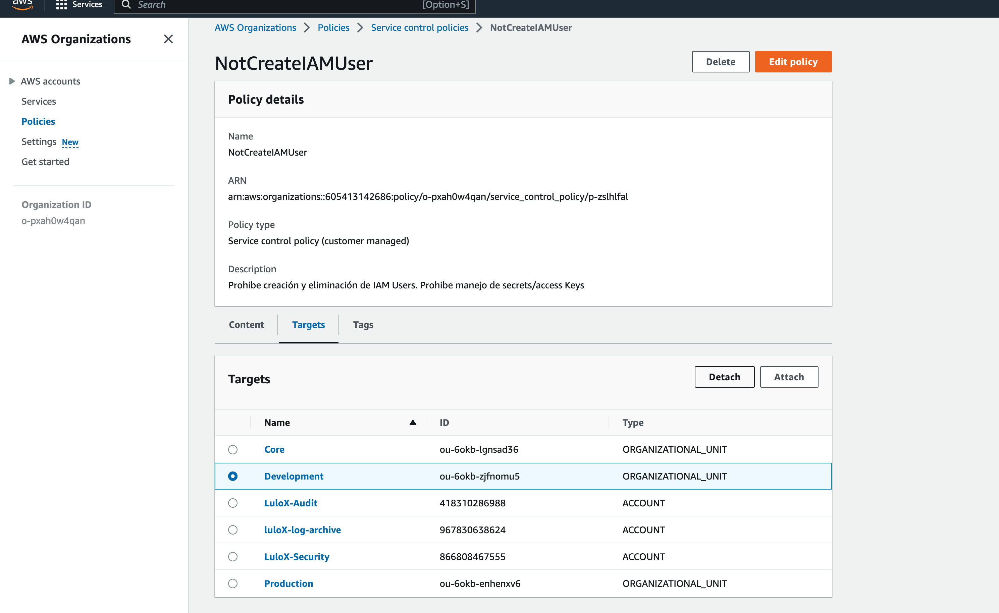

# 1. Se decidión lanzar el .yaml en un solo archivo llamado all_lab.yaml el cual contiene:
- Configuración del pod
- Rol
- Role binding
- Service
- Persistent Volume Claim

# 2. Para el user martin:
Ejecutamos los siguientes comandos:

kubectl config set-credentials martin --client-certificate ./martin.crt --client-key ./martin.key
kubectl config set-context developer --cluster kubernetes --user martin
kubectl config use-context developer

Nota: se debe ejecutar primero el yaml y de ultimas los comandos relacionados a martin

# 3. Evidencias:

