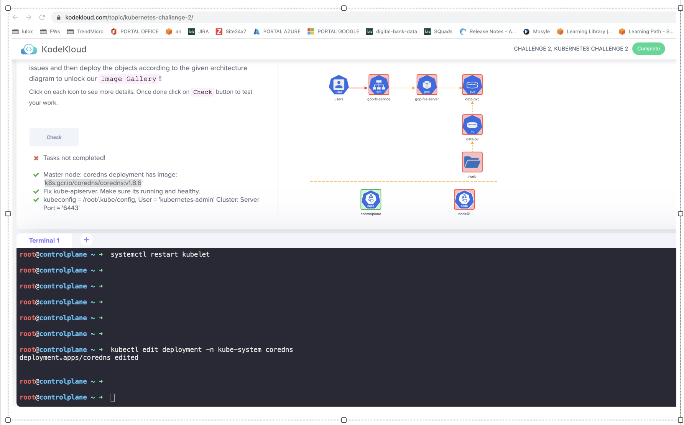
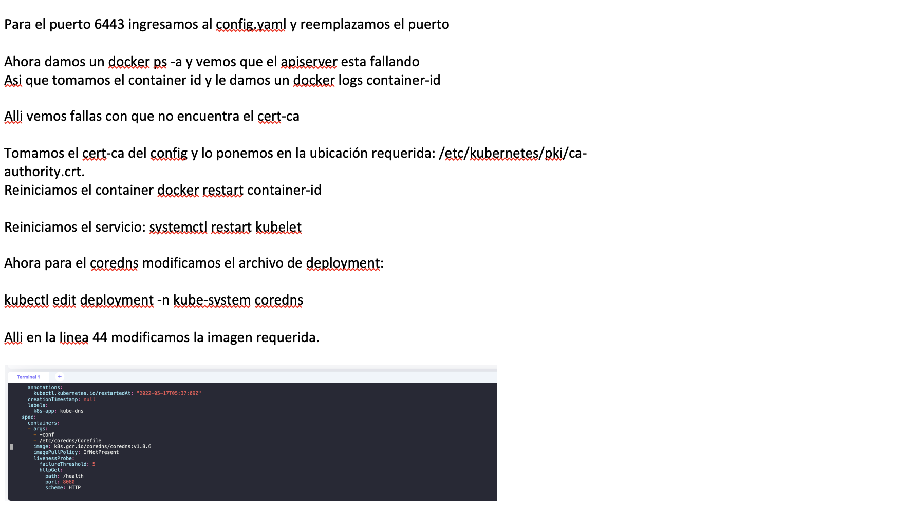
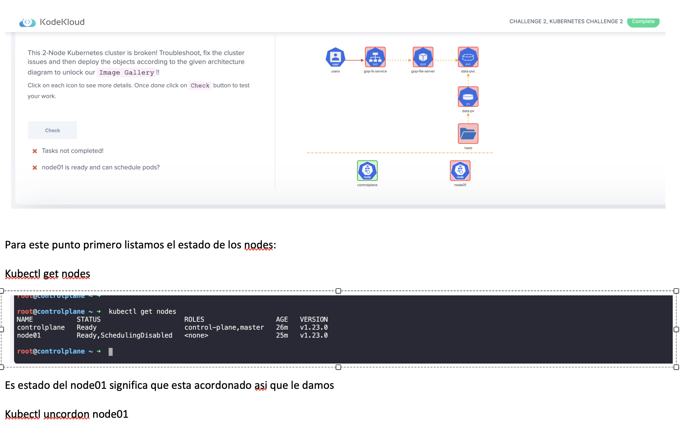
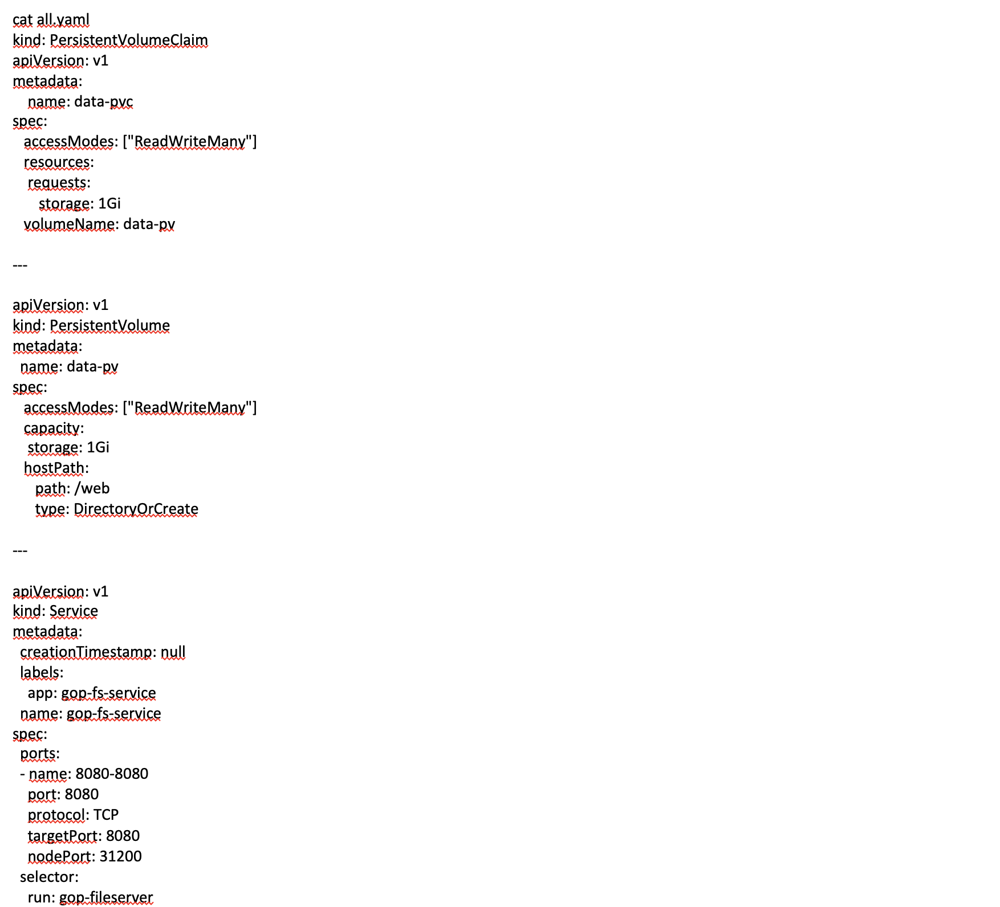

#Solucion de ejercicio CHALLENGE 2 KUBERNETES KODEKLOUD

El yaml que contiene los servicios, pods y volumenes esta en el archivo all_yaml.yaml

y a continuacion se ve un par de pantallazos del proceso ejecutado:

